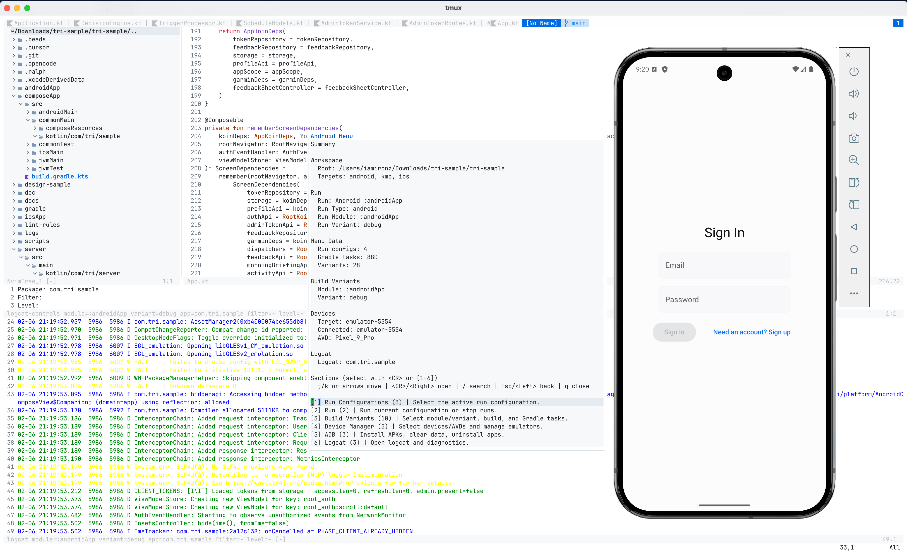

# android-nvim-plugin

[](https://github.com/iamironz/android-nvim-plugin/actions/workflows/tests.yml)
[](LICENSE)
[](https://neovim.io)

Neovim plugin for Android and mobile development workflows: build, run, logcat,
device management, and Gradle tasks.



## Compatibility

| Area | Support | Notes |
| --- | --- | --- |
| Neovim | 0.9+ | Lua support required |
| Android | Android SDK tools and `adb` | Required for Android actions |
| iOS | Xcode tools | Required for iOS actions |
| KMP | Kotlin Multiplatform plugin | Enables KMP target detection |
| UI picker | Telescope or `vim.ui` | Telescope is optional |

## Quick Start

1. Install the plugin. See [docs/install.md](docs/install.md).
1. Configure setup in your Neovim config:

```lua
require("android").setup()
```

1. Open a project and run `:AndroidMenu`.
1. Use `[1]`, `[2]`, and `<CR>` to enter sections. Use `/` to search.

Full first-run walkthrough: [docs/getting-started.md](docs/getting-started.md)

## What You Can Do

- Navigate hub menus with explicit section shortcuts and summary context.
- Build and deploy with saved defaults or prompt-driven selections.
- Inspect logcat in a docked panel with fixed controls and stack trace jumps.
- Manage devices, emulators, and app install/clear/uninstall actions.
- Run Android/iOS/JVM/Gradle/shell run configs, including `Run All` orchestration.

## Documentation

Docs home: [docs/README.md](docs/README.md)

| Goal | Doc |
| --- | --- |
| Install and first run | [docs/getting-started.md](docs/getting-started.md), [docs/install.md](docs/install.md) |
| Menu navigation and workflows | [docs/guides/navigation.md](docs/guides/navigation.md) |
| Build and deploy | [docs/guides/build-and-deploy.md](docs/guides/build-and-deploy.md) |
| Logcat usage | [docs/guides/logcat.md](docs/guides/logcat.md) |
| Devices and ADB | [docs/guides/devices-and-adb.md](docs/guides/devices-and-adb.md) |
| Run configuration model | [docs/guides/run-configs.md](docs/guides/run-configs.md) |
| Command/config/keymap reference | [docs/reference/commands.md](docs/reference/commands.md), [docs/reference/configuration.md](docs/reference/configuration.md), [docs/reference/keymaps.md](docs/reference/keymaps.md) |
| Troubleshooting | [docs/support/troubleshooting.md](docs/support/troubleshooting.md) |
| Maintainer workflows | [docs/maintainers/development.md](docs/maintainers/development.md), [docs/maintainers/release.md](docs/maintainers/release.md), [docs/maintainers/triage.md](docs/maintainers/triage.md) |
| Roadmap and change log | [docs/roadmap.md](docs/roadmap.md), [CHANGELOG.md](CHANGELOG.md) |

## Contributing

See [CONTRIBUTING.md](CONTRIBUTING.md).

## License

MIT
